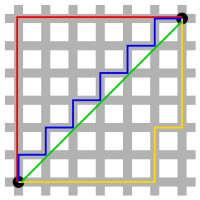

# 사용 언어 : JAVA

# 구현 방법

## 초기 구현 방법

- 패드에 따른 좌표값 배정
- 각각의 패드 좌표와 손 위지 차표를 피타고라스 정의에 의한 길이 비교
- 1,4,7왼손 // 3,6,7오른손 // 나머지 각 손의 거리 및 손잡이에 따라 배정
```java
package PressKeyPad;

public class Solution {

    public static void main(String[] args) {
        String hand = "right";
        int[] numbers = {1,3,4,5,8,2,1,4,5,9,5};
        String answer = "";
        int[][] pad = {{0, 1}, {3, 0}, {3, 1}, {3, 2}, {2, 0}, {2, 1}, {2, 2}, {1, 0}, {1, 1}, {1, 2}, {0, 0}, {0, 2}};//0,1,2,3,4,5,6,7,8,9,*,#
        answer = getAnswer(numbers, pad, hand);
        System.out.println(answer);
    }

    private static String getAnswer(int[] numbers, int[][] pad, String hand) {
        StringBuilder answer = new StringBuilder();
        // 좌표위치 초기화
        int rx = pad[10][0];
        int ry = pad[10][1];
        int lx = pad[11][0];
        int ly = pad[11][1];

        int rDistance=0;
        int lDistance=0;

        for (int i : numbers) { //거리 피타고라스의 정의로 구함
            rDistance = (rx - pad[i][0]) * (rx - pad[i][0]) + (ry - pad[i][1]) * (ry - pad[i][1]);
            lDistance = (lx - pad[i][0]) * (lx - pad[i][0]) + (ly - pad[i][1]) * (ly - pad[i][1]);
            if(i == 1 || i == 4 || i == 7) {
                answer.append("L");
                lx = pad[i][0];
                ly = pad[i][1];
            } else if (i == 3 || i == 6 || i == 9) {
                answer.append("R");
                rx = pad[i][0];
                ry = pad[i][1];
            }
            else{
                if (rDistance == lDistance) {
                    if (hand.equals("right")) {
                        answer.append("R");
                        rx = pad[i][0];
                        ry = pad[i][1];
                    } else {
                        answer.append("L");
                        lx = pad[i][0];
                        ly = pad[i][1];
                    }
                } else if (rDistance > lDistance) {
                    answer.append("L");
                    lx = pad[i][0];
                    ly = pad[i][1];
                } else if (rDistance < lDistance) {
                    answer.append("R");
                    rx = pad[i][0];
                    ry = pad[i][1];
                }
            }
        }
        return answer.toString();
    }
}
```

## 문제점

## ** 문제에서 다음과 같이 언급함 **
"엄지손가락은 상하좌우 4가지 방향으로만 이동할 수 있으며 키패드 이동 한 칸은 거리로 1에 해당합니다."
<br>
<br>
 해당 문구를 통해 피타고라스의 정의가 아닌 "맨하탄 거리"를 이용하여 문제를 풀어야 한다는 것을 알아야 통과 할 수 있음

## 맨하탄 거리란?
<br>
<CENTER></CENTER>
<br>
이미지의 블록 처럼 각 위치의 x,y값 차이의 절대값을 이용한 거리 계산법이다.

피타고라스의 정의를 이용한 유클리드 계산법에 의하면 최단거리는 초록선 선 이지만, 맨하탄 거리에 따르면 빨강, 노랑, 파랑 모두 같은 최단거리이다.

맨하탄 거리기법을 이용하면 문제에서 요구한 상하좌우 4가지 방향으로'만' 이동할 수 있다는 요건을 만족할 수 있다.

혹시 문제를 풀다가 오류가 난다면 다음과 같이 시도해 보자

## 맨하탄 적용 코드
```java
class Solution {
    public String solution(int[] numbers, String hand) {
        String answer = "";
        int[][] pad = {{0, 1}, {3, 0}, {3, 1}, {3, 2}, {2, 0}, {2, 1}, {2, 2}, {1, 0}, {1, 1}, {1, 2}, {0, 0}, {0, 2}};//0,1,2,3,4,5,6,7,8,9,*,#
        answer = getAnswer(numbers, pad, hand);
        return answer;
    }
   private static String getAnswer(int[] numbers, int[][] pad, String hand) {
        StringBuilder answer = new StringBuilder();
        int rx = pad[10][0];
        int ry = pad[10][1];
        int lx = pad[11][0];
        int ly = pad[11][1];

        int rDistance;
        int lDistance;

        for (int i : numbers) {
            rDistance = Math.abs(rx - pad[i][0]) + Math.abs(ry - pad[i][1]);
            lDistance = Math.abs(lx - pad[i][0]) + Math.abs(ly - pad[i][1]);
            if(i == 1 || i == 4 || i == 7) {
                answer.append("L");
                lx = pad[i][0];
                ly = pad[i][1];
            } else if (i == 3 || i == 6 || i == 9) {
                answer.append("R");
                rx = pad[i][0];
                ry = pad[i][1];
            }
            else{
                if (rDistance == lDistance) {
                    if (hand.equals("right")) {
                        answer.append("R");
                        rx = pad[i][0];
                        ry = pad[i][1];
                    } else {
                        answer.append("L");
                        lx = pad[i][0];
                        ly = pad[i][1];
                    }
                } else if (rDistance > lDistance) {
                    answer.append("L");
                    lx = pad[i][0];
                    ly = pad[i][1];
                } else if (rDistance < lDistance) {
                    answer.append("R");
                    rx = pad[i][0];
                    ry = pad[i][1];
                }
            }
        }
        return answer.toString();
    }
}
```
